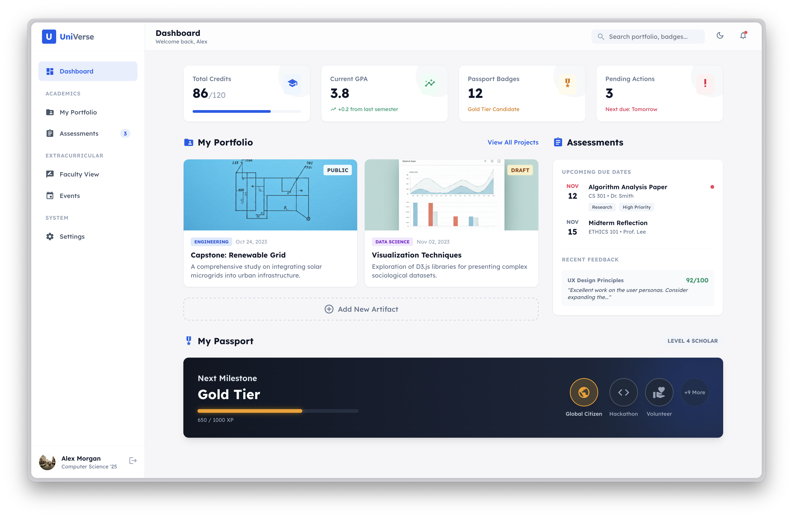
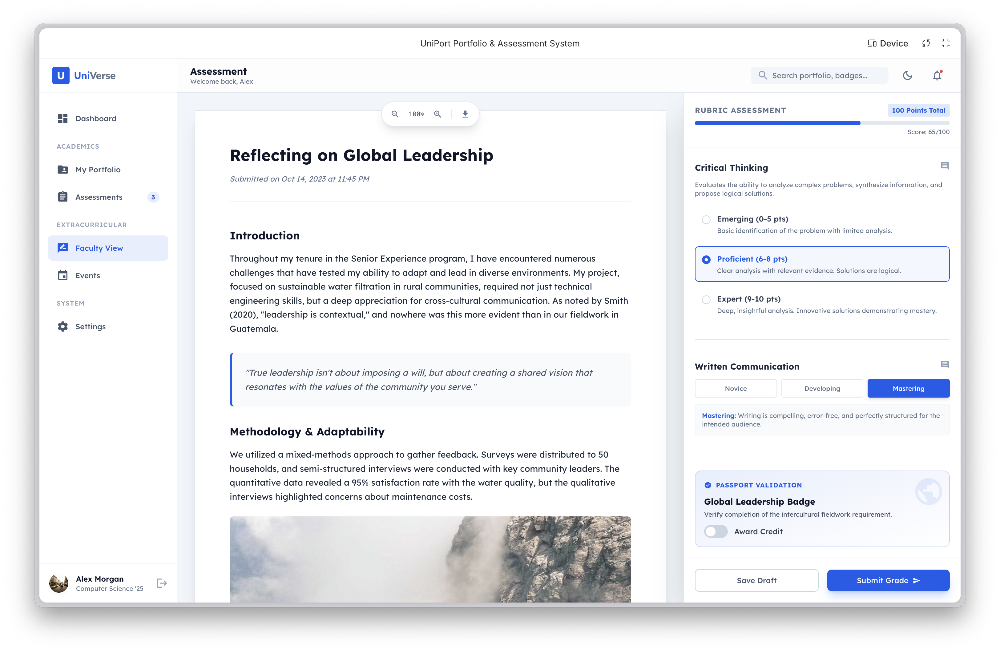

# UniVerse: The Unified Student Success Ecosystem

**Bridging the Gap Between Classroom Achievement and Career Readiness.**

UniVerse is a modern, high-performance student success platform designed to help students transform their academic record into a compelling professional narrative. It unifies academic artifacts, extracurricular milestones, and AI-driven career guidance into a single, cohesive experience.

---

## Why UniVerse?

### Professional Artifact Portfolio
Move beyond simple grades. UniVerse provides a sophisticated digital vault where students host their best work—from engineering capstones to data science visualizations. Each artifact is enriched with faculty feedback and competency tracking.

### Extracurricular Passport
Verify your impact. Our gamified badge system tracks growth in critical areas like **Global Leadership**, **Civic Engagement**, and **Innovation**. Every badge is backed by a serial-coded evidence log, making achievements undeniable.

### Gemini-Powered Career Coaching
Harness the power of **Google Gemini 3 Pro**. Our AI Career Coach doesn't just give advice—it analyzes your specific portfolio and passport data to find real-world internships, identify skill gaps, and provide strategic career insights.

---

## The UniVerse Experience

### 1. The Student Command Center
The Dashboard offers a high-fidelity overview of your academic standing, passport progress, and upcoming milestones. It’s designed for clarity, helping you stay ahead of deadlines while tracking your path to the "Gold Tier" scholar status.


*Modern, card-based interface providing real-time stats and artifact previews.*

### 2. Integrated Assessment
Assessement is integrated from the start, for students and faculty alike.


*A student assssement view.*


*A faculty assssement view.*

---

## Technical Stack

UniVerse is built with a focus on performance, accessibility, and modern aesthetics:
- **Framework:** React 19 + TypeScript
- **Styling:** Tailwind CSS (Class-based Dark Mode)
- **AI Intelligence:** Google Gemini 3 Pro (with Search Grounding)
- **Typography:** Lexend (Modern Sans-Serif)
- **Animations:** CSS3 Transitions & Framer-inspired "animate-in" effects

---

## How to Run UniVerse

### Prerequisites
- **Google Gemini API Key**: Ensure you have an API key with access to the Gemini 3 models.

### Installation & Execution
1.  **Clone the Repository**:
    ```bash
    git clone https://github.com/your-username/universe-portfolio.git
    cd universe-portfolio
    ```
2.  **Configuration**:
    The application relies on `process.env.API_KEY` for AI features. Ensure this is configured in your environment.
3.  **Launch the Development Server**:
    ```bash
    npm install
    npm run dev
    ```
4.  **Access the Platform**:
    Open [http://localhost:3000](http://localhost:3000) in your modern web browser.

---

Designed for the next generation of scholars and professional leaders.