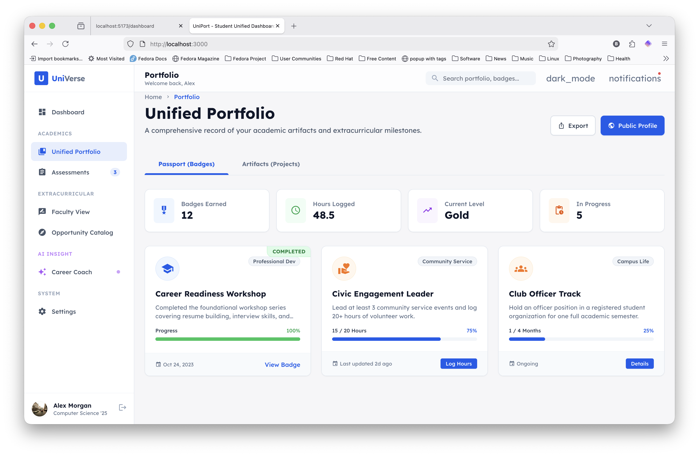
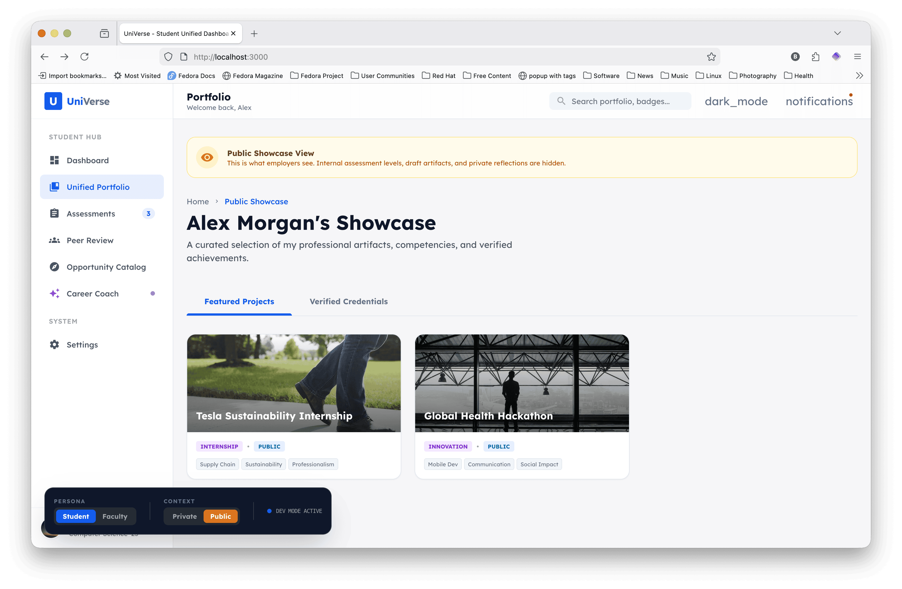
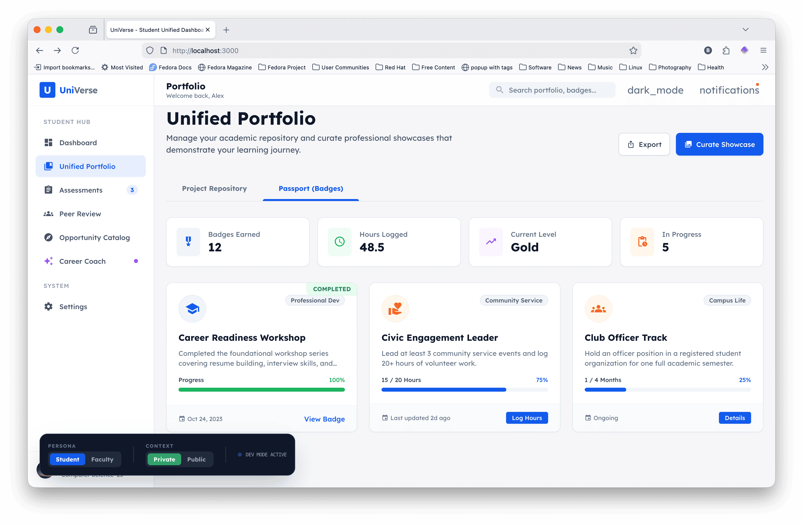

# UniVerse: The Unified Student Success Ecosystem

**Unifying Academic Achievement and Co-Curricular Learning into a Single Professional Narrative.**

> **Note: Rapid Prototype**  
> This project is a **rapid functional prototype** designed to test and demonstrate core ePortfolio pedagogical concepts. It is not intended for production use but rather as a vehicle for user feedback and conceptual validation.

---

## Pedagogical Foundation: "Folio Thinking"

UniVerse is built upon the principles of **Folio Thinking**—a process of engaged learning that prioritizes reflection and connection over simple asset collection. Unlike a traditional LMS, UniVerse differentiates between the *repository* (the technology) and the *process* (the pedagogy).

### Beyond the Classroom: The Unified Record
Traditional academic ePortfolios often focus solely on course-based artifacts. UniVerse breaks these silos by integrating **co-curricular learning**—internships, leadership roles, volunteer work, and campus life—into the same reflective framework. This "Unified Record" ensures that a student's leadership on a community project is valued and assessed with the same rigor as a senior capstone.

### The "Collect, Select, Reflect, Connect" Model
The platform's architecture is grounded in this four-part operational workflow:

1.  **Collect:** A private workspace (The Repository) to archive all learning artifacts, whether academic or co-curricular.
2.  **Select:** Curatorial agency allowing students to choose specific evidence for diverse audiences.
3.  **Reflect:** Metacognitive narratives that explain the *why* behind the work.
4.  **Connect:** Integrative learning features that link concepts across disciplines and contexts (e.g., connecting a Business Ethics course to a Summer Internship).

For a detailed breakdown of our guiding principles, see our [ePortfolio Pedagogy Framework](docs/EPORTFOLIOS.md) and our [User Stories](docs/USER_STORIES.md).

---

## Key Features

### Unified Portfolio (Repository & Showcase)
Manage a messy learning archive in your private repository, then curate polished **Showcases** for employers or graduate schools. 

Here's the student's private view:



And their public "showcase":



### Extracurricular Passport
Verify your impact. Our gamified badge system tracks growth in critical areas like Global Leadership, Civic Engagement, and Innovation. Every badge is backed by a serial-coded evidence log, making achievements undeniable.



### Integrated Assessment
Authentic assessment is integrated from the start, for student and faculty alike.


---

### Dev Mode Persona Switcher
To facilitate rapid testing of the prototype, we have implemented a **Global Persona Switcher**. This persistent overlay allows developers to instantly toggle between:
- **Student vs. Faculty Personas:** Switching navigation, dashboards, and profile contexts.
- **Private vs. Public Contexts:** Verifying what is visible to the public (Showcase) versus what remains in the student's private workspace (Repository).

---

## Technical Stack

UniVerse is built with a focus on performance, accessibility, and modern aesthetics:
- Framework: React 19 + TypeScript
- Styling: Tailwind CSS (Class-based Dark Mode)
- AI Intelligence: Google Gemini 3 Pro (with Search Grounding)
- Typography: Lexend (Modern Sans-Serif)
- Animations: CSS3 Transitions and animate-in effects

---

## How to Run UniVerse

### Prerequisites
- Google Gemini API Key: Ensure you have an API key with access to the Gemini 3 models.

### Installation and Execution
1. Clone the Repository:
   ```bash
   git clone https://github.com/your-username/universe-portfolio.git
   cd universe-portfolio
   ```
2. Configuration:
   The application relies on process.env.API_KEY for AI features. Ensure this is configured in your environment.
3. Launch the Development Server:
   ```bash
   npm install
   npm run dev
   ```
4. Access the Platform:
   Open http://localhost:3000 in your modern web browser.

---

Designed for the next generation of scholars and professional leaders.
