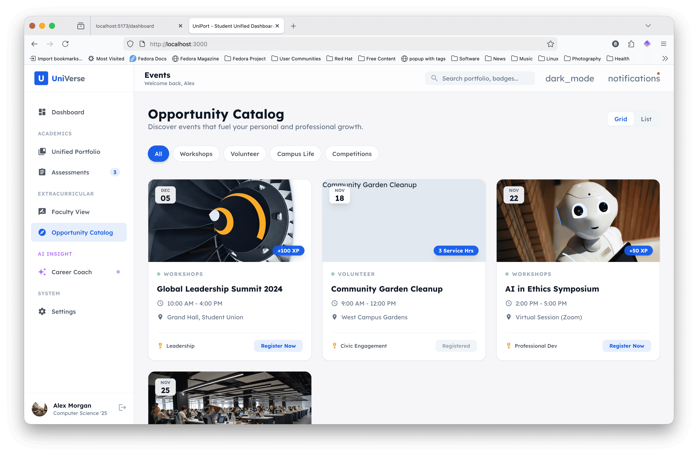

# UniVerse: The Unified Student Success Ecosystem

**Bridging the Gap Between Classroom Achievement and Career Readiness.**

UniVerse is a modern, high-performance student success platform designed to help students transform their academic record into a compelling professional narrative. It unifies academic artifacts, extracurricular milestones, and AI-driven career guidance into a single, cohesive experience.

---

## Why UniVerse?

### Professional Artifact Portfolio
Move beyond simple grades. UniVerse provides a sophisticated digital vault where students host their best work, from engineering capstones to data science visualizations. Each artifact is enriched with faculty feedback and competency tracking.


### Extracurricular Passport
Verify your impact. Our gamified badge system tracks growth in critical areas like Global Leadership, Civic Engagement, and Innovation. Every badge is backed by a serial-coded evidence log, making achievements undeniable.



### Integrated Assessment
Authentic assessment is integrated from the start, for student and faculty alike.


---

## Technical Stack

UniVerse is built with a focus on performance, accessibility, and modern aesthetics:
- Framework: React 19 + TypeScript
- Styling: Tailwind CSS (Class-based Dark Mode)
- AI Intelligence: Google Gemini 3 Pro (with Search Grounding)
- Typography: Lexend (Modern Sans-Serif)
- Animations: CSS3 Transitions and animate-in effects

---

## How to Run UniVerse

### Prerequisites
- Google Gemini API Key: Ensure you have an API key with access to the Gemini 3 models.

### Installation and Execution
1. Clone the Repository:
   ```bash
   git clone https://github.com/your-username/universe-portfolio.git
   cd universe-portfolio
   ```
2. Configuration:
   The application relies on process.env.API_KEY for AI features. Ensure this is configured in your environment.
3. Launch the Development Server:
   ```bash
   npm install
   npm run dev
   ```
4. Access the Platform:
   Open http://localhost:3000 in your modern web browser.

---

Designed for the next generation of scholars and professional leaders.
